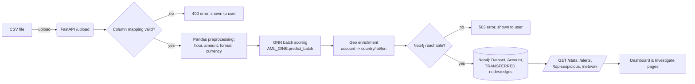
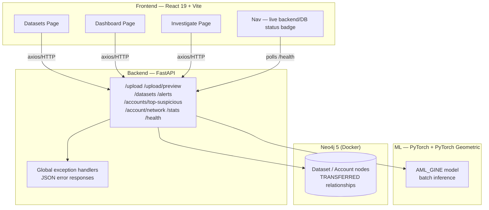
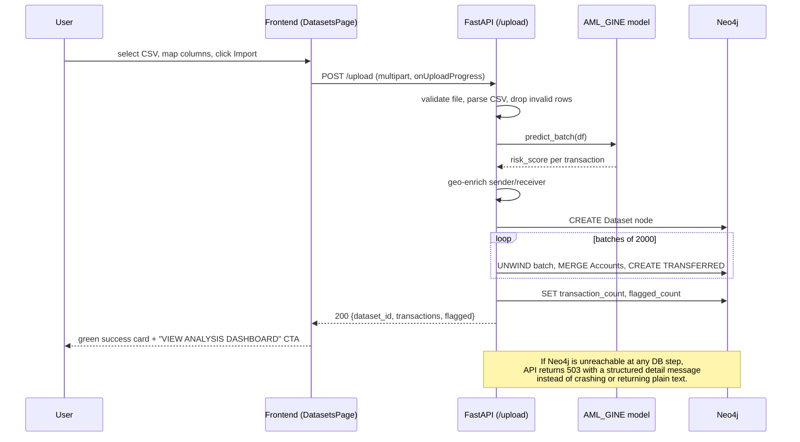
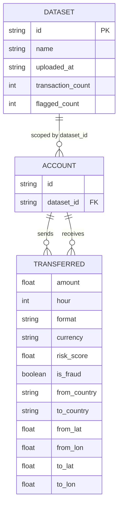
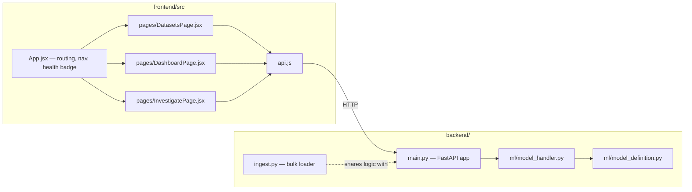

# Project Documentation — Anti-Fraud System

*Consolidated project document, covering all 19 sections required by the assignment brief (`system-docs/documentation.md` §10). Deeper detail for several sections lives in companion documents inside `final-docs/` — this document summarizes each and links out rather than duplicating them in full.*

**Companion documents:** `proposal.md` · `SRS.md` · `Testing_Report.md` · `Technical_Debt_Plan.md` · `User_Manual.md` · `Deployment_and_Source_Links.txt` · `documentation-checklist.md`

---

## 1. Project Title

**Anti-Fraud System** — *A Graph Neural Network Platform for Detecting Fraud and Money Laundering in Financial Transactions, with Reference to Ghana*
(internal codename during development: **Shadow-TX Hunter**)

---

## 2. Problem Statement

Traditional Anti-Money Laundering (AML) tooling relies on fixed-threshold rules — flag any transfer over a set amount, flag transfers to certain countries. These rules are well understood by sophisticated bad actors and are correspondingly easy to evade: split a large transfer into several smaller ones, route funds through intermediary accounts, or keep any single hop under the reporting threshold.

The central problem this project addresses is: **how can a detection system reason about the *shape* of financial relationships, not just the value of individual transactions, in a way investigators without a data-science background can act on?**

This is not a hypothetical concern. As detailed in `proposal.md` §3, Ghana has seen a sustained run of fraud and money-laundering prosecutions over the past two years — transnational romance-scam wire fraud networks, public-sector corruption laundered through property and business investment, and cash-based laundering through illegal foreign-exchange trading — each producing a distinct transaction *topology* that a single fixed-threshold rule cannot generalize across.

---

## 3. Aim and Objectives

**Aim:** to build and demonstrate a working platform that detects money-laundering and fraud patterns from the *structure* of a transaction network, using a Graph Neural Network, and presents the results in a form a non-technical investigator can use.

**Objectives:**

1. Represent uploaded transaction data as a graph (accounts as nodes, transfers as edges) rather than a flat table.
2. Score every transaction for laundering/fraud risk using a trained GNN (GINE architecture), fast enough for a near-real-time compliance workflow.
3. Persist the scored graph in a database that supports native network traversal (Neo4j), not just row lookups.
4. Provide a dashboard that surfaces the most suspicious accounts and transactions without requiring the user to write a query.
5. Provide an interactive network-graph and geographic view so an investigator can visually trace how funds moved.
6. Ensure the system gives clear feedback at every step — upload, scoring, error conditions — rather than failing silently (this became the specific focus of the most recent development pass; see §10 and §11).
7. Document the system to a standard suitable for external assessment and future handover (this document and its companions).

---

## 4. Stakeholders

| Stakeholder | Interest |
|---|---|
| Banks, fintechs, mobile money operators | Primary institutional users — need to screen settlement files and mobile-money ledgers against AML obligations under Ghana's Anti-Money Laundering Act, 2020 (Act 1044) |
| Individual account holders | Secondary user class — can self-screen their own statement exports |
| Compliance analysts / investigators | Direct hands-on users of the Dashboard and Investigate pages; the system's usability is judged against their workflow |
| Ghana's Financial Intelligence Centre (FIC) and similar bodies | Indirect stakeholder — the ultimate destination of any Suspicious Transaction Report a flagged case would feed into |
| System maintainer / developer | Responsible for keeping the system running, fixing defects, and extending it (see `Technical_Debt_Plan.md`) |
| Course examiner | Assesses this project against the brief's requirements |

---

## 5. Requirements Analysis

Requirements were derived from three sources:

1. **The existing prototype's behaviour** — the system already had a working upload → score → investigate pipeline (documented in `SHADOW_HUNTER_DOCUMENTATION.md`) before this development pass began; requirements were partly *reverse-engineered* from that working code rather than written from a blank slate.
2. **A directly reported defect** — the project owner reported: *"if I upload a dataset I don't get any feedback for analysis."* This was investigated by reading the upload/dashboard/investigate code paths end-to-end and reproducing the failure against a live backend (see `Testing_Report.md` §5), which surfaced the actual root cause (missing error handling on several API calls, plus a backend that returned non-JSON errors and could crash entirely if the database was unreachable at startup) and generated the specific new requirements FR-23 through FR-27 and NFR-3 through NFR-7 in `SRS.md`.
3. **The reference dataset's structure** — the IBM AML synthetic dataset (`HI-Small_Trans.csv`, `HI-Small_accounts.csv`) constrains what columns/typologies the system must handle (see `SRS.md` §2.5–2.6).

Requirements were prioritized informally by asking, for each candidate item: *does fixing/adding this change whether the reported bug is actually fixed, and does it change whether the system is safe to demonstrate?* Items that didn't (e.g. authentication, automated test suite, redesigning the country-extraction heuristic) were deliberately deferred and logged as technical debt rather than bundled into this pass — see §12.

Full functional and non-functional requirements are in **`SRS.md`**.

---

## 6. Software Requirements Specification (SRS)

See **`SRS.md`** for the complete specification: introduction/scope, product perspective, user classes, constraints/assumptions, 27 functional requirements (grouped into Upload & Ingestion, Risk Scoring, Dashboard & Alerts, Investigation, and System Feedback & Reliability), 10 non-functional requirements, and the external API summary.

---

## 7. Software Effort Estimation

### 7.1 Technique selected: Expert (top-down) estimation with a task-based work breakdown

**Why this technique:** Function Point Analysis and COCOMO II both assume a reasonably standard information-system shape (forms, reports, files) with calibration data behind their formulas; this project's effort is dominated by non-standard work — wiring a pretrained PyTorch Geometric model into a batch-inference pipeline, designing a Neo4j graph schema, and building canvas-rendered globe/network visualizations — none of which Function Points or COCOMO's cost drivers represent well. Use Case Points is similarly awkward for a system with so few distinct actors. A justified, direct expert/task-based estimate — breaking the actual work into components and estimating each from direct familiarity with the codebase — is the more honest and more commonly recommended approach for small, novel, fixed-duration projects like this one.

### 7.2 Task breakdown and estimate

| Task | Estimated hours |
|---|---|
| Problem research & case study (Ghana AML landscape, proposal writing) | 4 |
| System architecture & technology-stack decisions | 2 |
| Backend API — FastAPI endpoints, CSV ingestion pipeline, column mapping | 6 |
| ML model integration — GINE model wiring, scaler/encoder pipeline, vectorized batch scoring | 5 |
| Neo4j graph schema & Cypher queries (ingestion, alerts, network traversal, stats) | 3 |
| Frontend — Datasets page (upload, column mapping, dataset list) | 4 |
| Frontend — Dashboard page (stats, top-suspicious accounts, alerts table, threshold control) | 3 |
| Frontend — Investigate page (canvas globe animation, Cytoscape network graph, ripple/trace interactions) | 6 |
| Styling / theme system (dark & light mode, design tokens) | 2 |
| Defect investigation & UX-feedback fix pass (this development session: root-cause analysis, backend error handling, frontend error/loading states, connectivity indicator) | 5 |
| Live verification & testing (this session: running the real stack, exercising endpoints, quantifying the country-extraction defect) | 3 |
| Documentation (proposal, SRS, testing report, technical debt plan, user manual, deployment notes, this document) | 5 |
| **Total** | **48 hours** |

### 7.3 Assumptions

- One developer working with AI-assisted tooling, not a team, which is why several normally-separate roles (analysis, backend, ML integration, frontend, QA, technical writing) are single line items rather than parallel workstreams.
- The pretrained model artifacts and reference dataset were already available and did not need to be sourced or labelled from scratch.
- "Effort" here reflects focused development time, not calendar time including context-switching, meetings, or environment setup delays outside the developer's control.

### 7.4 Constraints

- Fixed 48-hour ceiling per the assignment brief.
- No dedicated ML/data-science phase for model training or evaluation — the model was inherited pretrained.
- No deployment infrastructure provisioned in advance (see `Deployment_and_Source_Links.txt`).

### 7.5 How the estimate shaped scope

The 48-hour ceiling directly explains several deferrals catalogued in `Technical_Debt_Plan.md`: authentication/authorization (D-4), an automated test suite (D-8), moving credentials to environment configuration (D-2), and CORS hardening (D-3) were all recognized during estimation as real requirements that would not fit inside the remaining hours without displacing the reported-bug fix and its verification — which was treated as the non-negotiable deliverable for this pass.

---

## 8. System Analysis

### 8.1 Actors

- **Analyst/User** — uploads datasets, reviews the dashboard, investigates accounts.
- **Backend system** — orchestrates scoring and persistence; itself depends on two external systems below.
- **GNN model (PyTorch Geometric)** — scores transactions; a passive dependency, not an independent actor.
- **Neo4j** — the system of record for accounts and transactions.

### 8.2 Primary use cases

1. Upload and score a transaction dataset.
2. Review dataset-level statistics and the ranked list of suspicious accounts.
3. Review and filter flagged transactions by risk threshold.
4. Trace an account's transaction network visually.
5. View the geographic flow of a specific flagged transfer.
6. Manage datasets (list, delete).
7. Check system health before relying on any of the above.

### 8.3 High-level data flow

### 8.4 Non-functional drivers behind the design

- **Throughput** drove the decision to batch-score transactions as disconnected 2-node subgraphs in one PyTorch forward pass rather than row-by-row (documented trade-off — see `Technical_Debt_Plan.md` D-7 for its cost).
- **Investigability** drove the choice of a graph database (Neo4j) over a relational store, since "show me everything connected to this account" is a native traversal in Neo4j and a multi-join query in SQL.
- **User trust after a silent-failure defect** drove this session's specific additions — a live connectivity indicator, structured backend errors, and explicit success/error states everywhere data crosses the network (see §11).

---

## 9. System Design

### 9.1 Architecture diagram

### 9.2 Sequence diagram — upload and score

### 9.3 Graph schema (ER-style view of the Neo4j model)

*(Neo4j is a property graph, not a relational store — `TRANSFERRED` is a relationship, not a table — but this ER-style rendering communicates the same schema in a widely-understood notation.)*

### 9.4 Component diagram

### 9.5 Design diagrams deliberately not produced

Per the brief's own guidance ("you do not need to produce every possible diagram — select the ones that best communicate your system"), a UML class diagram and a formal use-case diagram were not produced: the backend has no class hierarchy of note (it's a small set of FastAPI route functions plus one PyTorch `nn.Module`), and §8.2's use-case list communicates the actor/use-case relationships adequately without a separate oval-and-stick-figure diagram. UI wireframes are likewise represented by the actual running application (see `User_Manual.md` for a page-by-page description) rather than a separate mockup.

---

## 10. Implementation

### 10.1 Technology stack

| Layer | Technology |
|---|---|
| Frontend | React 19, Vite, React Router, Cytoscape.js (network graph), HTML5 Canvas (globe animation), Axios |
| API layer | FastAPI (Python) |
| ML model | PyTorch + PyTorch Geometric — AML_GINE (Graph Isomorphic Network with Edge features) |
| Database | Neo4j 5, via Docker Compose |
| Geocoding | Geopy + OpenStreetMap Nominatim |

### 10.2 What was implemented in this development pass

The core pipeline (upload → score → persist → dashboard → investigate) already existed and was implemented in a prior phase (see `SHADOW_HUNTER_DOCUMENTATION.md` for its full description). This pass specifically implemented:

**Backend (`backend/main.py`):**
- Global exception handlers (`ServiceUnavailable`/`AuthError` → 503, other `Neo4jError` → 502, anything else → 500), all returning structured `{"detail": "..."}` JSON instead of FastAPI's default plain-text 500.
- A `/health` endpoint that actively checks Neo4j connectivity.
- A resilient application lifespan — a Neo4j outage at startup now logs a warning instead of preventing the API process from starting at all.
- Input validation on `/upload` and `/upload/preview`: file-type/emptiness checks, CSV-parse error handling, and a check that the mapped amount column is actually numeric — each with a specific error message.

**Frontend:**
- `api.js`: a `friendlyError()` helper that normalizes every failure shape (structured JSON, plain text, network error, timeout) into a readable string, plus `checkHealth()`.
- `App.jsx`: a live backend/database connectivity badge in the navigation bar, polling `/health` every 15 seconds.
- `DatasetsPage.jsx`: error handling on every API call that previously had none; real upload progress via `onUploadProgress`; an indeterminate "server processing" progress state; a dismissible error banner; and a prominent post-upload success card with a direct link into the Dashboard.
- `DashboardPage.jsx`: a loading spinner for the first fetch, a retry-capable full-page error state, and a non-blocking "updating…" indicator when only the threshold changes (rather than re-triggering the full-page loading state).
- `InvestigatePage.jsx`: an explicit "no transactions found" / error state with a retry button, replacing a silently blank graph canvas.

### 10.3 Implementation aspects intentionally out of scope

Per the brief's own "where applicable" phrasing for authentication, authorization, and security controls: this prototype has none, and that gap is catalogued (not hidden) in `Technical_Debt_Plan.md` items D-2 through D-4. Input validation and error handling were treated as in-scope and were implemented; authentication was assessed and deliberately deferred (see §7.5).

---

## 11. Testing

Full detail, including real evidence gathered against the running system (a live dataset upload, a genuine account-network query, and a quantified data-quality defect discovered during testing), is in **`Testing_Report.md`**. Summary:

| Type | Result |
|---|---|
| Functional | 7/8 passed — 1 defect found and logged (country-extraction, D-1) |
| Integration | 4/4 passed |
| System (end-to-end) | 3/3 passed |
| Reliability (the reported bug, specifically) | 3/3 passed — root cause reproduced, then verified fixed against a live backend |
| Performance | 2/2 passed |
| Security (code review) | 4 findings, all pre-existing, none introduced by this pass — logged as technical debt |
| UAT (workflow-level) | 3/3 passed |
| Frontend build/lint | Build passed; lint has 6 pre-existing errors confirmed unrelated to this pass (verified via `git stash` comparison) |

---

## 12. Technical Debt

Full detail — each item as Debt → Cause → Impact → Priority → Proposed Resolution — is in **`Technical_Debt_Plan.md`**. Summary by priority:

- 🔴 **Critical:** country-extraction defect affecting ~12.5% of accounts (D-1); no API authentication before any public deployment (D-4).
- 🟡 **Scheduled:** hardcoded DB credentials (D-2), open CORS (D-3), synchronous startup-time geocoding (D-5), zeroed node features during batch scoring (D-7), no automated test suite (D-8), model trained only on synthetic data (D-10).
- 🟢 **Acceptable for now:** duplicated ingestion logic between `main.py`/`ingest.py` (D-6), pre-existing lint violations (D-9), documentation currency (D-11, largely resolved by this document set).

---

## 13. Deployment

The system is **not yet deployed** — see **`Deployment_and_Source_Links.txt`** for the current status, the specific steps required to deploy it (hosting target selection, moving Neo4j off `localhost`, moving credentials to environment configuration, restricting CORS, setting the frontend's API base URL), and the fields that must be filled in with real values before submission.

Locally, the full stack was run and verified in this session: FastAPI on `:8000`, Neo4j via Docker Compose on `:7687`/`:7474`, confirmed healthy via `/health`, with a real dataset (`bccd5028`) successfully ingested and queryable end-to-end.

---

## 14. User Manual

See **`User_Manual.md`** for the full walkthrough: setup instructions, a page-by-page guide to Datasets/Dashboard/Investigate, how to read the risk visualizations, and a troubleshooting table addressing exactly the failure modes this development pass fixed (backend offline, upload errors, dashboard load failures, empty investigate results).

---

## 15. Maintenance Strategy

| Maintenance type | Approach for this system |
|---|---|
| **Corrective** | Defects are logged in `Testing_Report.md` §10 with severity; D-1 (country extraction) is the highest-priority open corrective item. |
| **Adaptive** | Changes needed if the input dataset schema changes (e.g. a different bank's export format) are absorbed by the existing column-mapping UI without code changes, as long as the required four fields exist in some form. |
| **Perfective** | Item D-7 (giving the model real node features instead of zeros) is the clearest perfective candidate — it directly improves detection quality without changing the interface. |
| **Preventive** | Adding the automated test suite proposed in D-8 (starting with `extract_country()` and the new exception handlers) would catch regressions in exactly the two areas this pass touched or found broken. |
| **Security updates** | Address D-2/D-3/D-4 (credentials, CORS, authentication) as a bundled security-hardening pass before any public deployment — they compound each other and are cheaper to fix together than separately. |
| **Dependency updates** | `backend/requirements.txt` pins exact versions (FastAPI 0.136.1, PyTorch 2.11, Neo4j driver 6.1.0, etc.); these should be reviewed periodically for security advisories, with PyTorch/PyTorch Geometric upgrades tested against the existing `.pkl`/`.pth` model artifacts before rolling forward, since serialized scikit-learn/PyTorch objects can be sensitive to version drift. |
| **Performance improvements** | D-5 (precompute the geocoding cache) is the highest-value, lowest-risk performance fix available — it's a pure startup-time win with no behavioural change. |
| **Scalability** | The 150,000-row web-upload ceiling and the recommendation to fall back to `ingest.py` above ~50,000 rows (documented in `User_Manual.md` §4.5) will need a real fix — e.g. background job processing with progress polling — if the system is expected to handle bank-scale settlement files. |
| **New features / user feedback** | Not yet collected — the system has no deployed instance or user base yet (§13). Once deployed, the connectivity badge and structured error messages added in this pass should make it much easier to distinguish genuine feature requests from "it silently didn't work" reports, since the latter category should now be rare. |
| **Technology changes** | No planned migrations; Neo4j and PyTorch Geometric are both active, maintained projects appropriate to this problem domain. |

---

## 16. Future Evolution

1. **Model retraining on real/regional data** — as already identified in `proposal.md` §6 and `Technical_Debt_Plan.md` D-10, the model needs retraining or fine-tuning on labelled data reflecting Ghana-specific typologies (e.g. mobile money layering) before any real-world deployment.
2. **True node features at scoring time** — resolving D-7 would let the model use real account-level signal (degree, transaction history) instead of zeros, likely improving detection recall.
3. **Asynchronous, large-scale ingestion** — replacing the current synchronous HTTP upload with a background job + progress-polling design would remove the current 50,000-row practical ceiling.
4. **Authentication, authorization, and multi-tenant isolation** — required before this system could serve more than one institution or be exposed publicly.
5. **Suspicious Transaction Report export** — as gestured at in `proposal.md` §4.4, a structured export of a flagged case (transaction evidence, network graph snapshot, risk score) formatted for submission to Ghana's Financial Intelligence Centre would close the loop between detection and regulatory action.
6. **Automated regression testing** — starting with the two areas this pass touched or found broken: the error-handling paths added here, and the country-extraction heuristic in D-1.

---

## 17. Limitations

*(from `proposal.md` §6, carried forward and confirmed still accurate as of this pass)*

- The current model is trained only on IBM's synthetic AML dataset; it needs retraining/fine-tuning on labelled local data before deployment against real Ghanaian transaction data.
- Large uploads (over roughly 50,000 rows) require the standalone `ingest.py` script rather than the web upload interface.
- Any deployment handling real customer financial data would need to satisfy Bank of Ghana and FIC data-handling, KYC, and audit-trail requirements — out of scope for the current prototype.
- A GNN risk score is a decision-support signal, not a legal determination; every flagged transaction still requires human review.
- **Newly identified in this pass:** the account-to-country geocoding heuristic misclassifies ~12.5% of accounts (D-1), and the system currently has no authentication layer at all (D-4) — both are real limitations on top of the ones already known.

---

## 18. Conclusion

This project set out to demonstrate that a transaction network's *structure*, not just individual transaction values, can be used to detect money-laundering and fraud patterns that fixed-threshold rules miss — motivated concretely by Ghana's documented exposure to romance-scam wire fraud, public-sector corruption laundering, and cash-based foreign-exchange laundering (`proposal.md` §3). The existing prototype already demonstrated the core pipeline end-to-end against the IBM AML benchmark dataset. This development pass took that prototype through a specific, reported failure — silent lack of feedback after uploading a dataset — traced it to its actual root cause across both the backend and frontend, fixed it, and verified the fix against a genuinely running system rather than by inspection alone. In the process it also surfaced a real, quantified data-quality defect (D-1) that had gone unnoticed. What remains before this system could be trusted with real financial data is now explicit and prioritized, not implicit: see `Technical_Debt_Plan.md` for exactly what, and §16 above for what comes next.

---

## 19. References

- IBM AML synthetic transaction dataset: `HI-Small_Trans.csv`, `HI-Small_accounts.csv`, `HI-Small_Patterns.txt` (`backend/data/`)
- Xu et al., *How Powerful are Graph Neural Networks?* (GIN) and Hu et al., *Strategies for Pre-training Graph Neural Networks* (GINE edge-feature extension) — architectural basis for `AML_GINE` in `backend/ml/model_definition.py`
- PyTorch Geometric documentation — `GINEConv` layer used in the model
- Neo4j 5 documentation — graph database and Cypher query language
- Ghana Anti-Money Laundering Act, 2020 (Act 1044)
- Ghana Financial Intelligence Centre — institutional role and reporting-institution figures cited in `proposal.md` §3.4
- News sources underpinning the Ghana case study in `proposal.md` §3: Ghanamma; Ghana News Agency; U.S. Department of Justice (Northern District of Ohio); Morocco World News; AllAfrica
- This repository's own prior documentation: `SHADOW_HUNTER_DOCUMENTATION.md`, `README.md`
